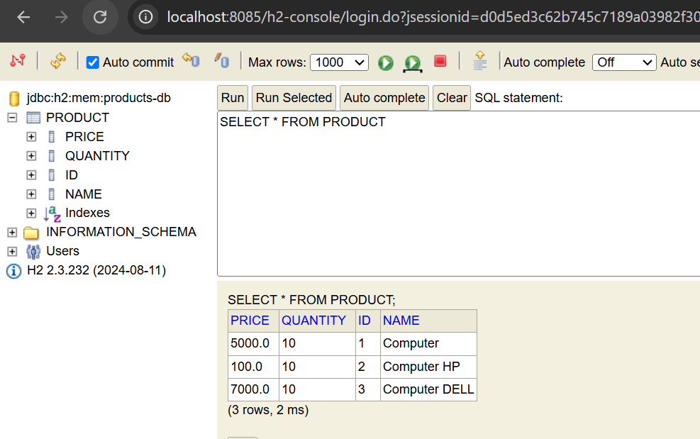

# StudentAppApplication

**StudentAppApplication** est une application Java développée avec **Spring Boot**, utilisant **Spring Data JPA** et **Hibernate** pour la gestion de la persistance.

Ce projet est basé sur le cours de **Prof.Mohamed Youssfi** , et il a été réalisé dans un cadre pédagogique pour comprendre l’architecture MVC, la persistance des entités, et l’utilisation des repositories Spring Data.

##  Fonctionnalités

- Ajouter des produits
- Consulter tous les produits
- Rechercher des produits par nom (avec mots-clés)
- Rechercher par nom et par prix
- Affichage console des résultats via `CommandLineRunner`

## Technologies utilisées

- Java 17
- Spring Boot
- Spring Data JPA
- Hibernate
- Lombok

## configuration de projet 

Pour la configuration, on utilise dans le fichier `application.properties` les lignes suivantes :

```properties
spring.application.name=student-app            # nom de l'application
server.port=8085                               # port du serveur
spring.datasource.url=jdbc:h2:mem:products-db  # URL de la base de données H2
spring.h2.console.enabled=true                 # activer la console H2
```
Quand on exécute notre application, on obtient dans le navigateur la page suivante :


Après avoir cliqué sur Connect,
on peut voir les entités existantes : 


## ajouter des prod a table de produit 
  
Ajouter des produits à la table Product
Pour enregistrer quelques produits, on modifie le code dans le fichier principal de l'application.
On a besoin d’exécuter le code d’ajout des produits dès que Spring démarre.

Pour simplifier cela, on fait en sorte que notre classe principale hérite de l’interface CommandLineRunner.
On implémente la méthode run(). Cette méthode est automatiquement appelée après le démarrage de l'application.

Le but est d’ajouter des produits à la base de données.

Pour cela, on utilise Spring Data JPA.
On crée un package repository, dans lequel on crée une interface ProductRepository.
##### Important : cette interface hérite de JpaRepository.

On peut maintenant utiliser cette interface pour ajouter les produits à la base de données.
Dans notre application, on déclare un objet de type ProductRepository et on utilise l’injection de dépendances avec @Autowired.
Ensuite, on ajoute les produits :


Résultat dans la base de données :



Pour la gestion du projet, on utilise toujours ProductRepository pour afficher les produits et effectuer des recherches dans la table à l’aide de méthodes déjà définies comme findAll(), findByName(), findByNameContains(), etc.

les methodes :

la methode search donne les meme resultat qye find by name 
```
@Query("select p from Product p where p.name like :x and p.price>:y")
List<Product> search(@Param(x) String kw,@Param(y) Double price);
```
Application:
```
        System.out.println("---- Résultats de search() : ------");

        // Appel de la méthode personnalisée "search" avec le mot-clé "%C%"
        List<Product> products3 = productRepository.search("%C%");

        // Affichage des résultats
        products3.forEach(prod -> {
            System.out.println(prod.toString());
        });```
```
Resultats :


## 

